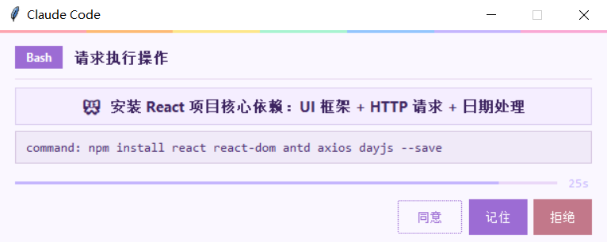
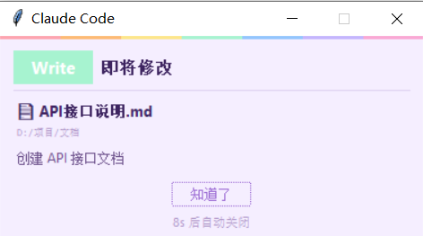
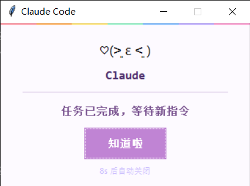

# Claude Code Hooks

Windows 桌面弹窗式权限确认 + 空闲提醒，替代 Claude Code 默认的终端内询问。不需要一直盯着终端，切出去做别的事，在需要确认时弹窗提醒。

## 功能

| 脚本 | 触发时机 | 效果 |
|------|---------|------|
| `permission_dialog.py` | Bash 操作前 | 弹窗确认（同意/拒绝/记住），28 秒超时 |
| `edit_notify.py` | Edit / Write / MultiEdit / NotebookEdit 操作前 | 轻量提醒弹窗，10 秒自动关闭，退回终端确认 |
| `idle_notify.py` | Claude Code 任务完成进入空闲 | 弹窗提醒，10 秒后自动关闭 |

## 使用说明

### 权限弹窗

Bash 命令执行前弹出确认窗口。



| 操作 | 效果 |
|------|------|
| 点「同意」| 批准本次操作（仅此一次，下次还会弹） |
| 点「记住」（**按 Enter**） | **= 记住并同意**，记住此工具并批准，以后同类操作不再询（**最省事，推荐）** |
| 点「拒绝」 | 阻止本次操作 |
| 关闭窗口 / 28 秒超时 | 不做决定，退回终端让你手动确认 |

### 编辑提醒 

Edit / Write / MultiEdit / NotebookEdit 操作前弹出轻量提醒，**不做拦截**，关闭后退回终端确认。



| 操作 | 效果 |
|------|------|
| 点「知道了」/ Enter / 关闭窗口 | 关闭提醒，去终端确认 |
| 等待 10 秒 | 自动关闭，去终端确认 |

> 注：此功能仅做提醒，需要手动去终端查看修改情况并确认是否修改。
>

### 空闲提醒

Claude Code 任务完成进入空闲时弹出提醒。



| 操作 | 效果 |
|------|------|
| 点「知道啦」/ Enter / 关闭窗口 | 关闭弹窗 |
| 等待 10 秒 | 自动关闭 |

## 工具覆盖范围

| 工具 | 危险程度 | 方式 |
|------|---------|------|
| `Bash` | 高 — 执行任意命令 | 弹窗确认（同意/拒绝/记住） |
| `Edit` / `Write` / `MultiEdit` / `NotebookEdit` | 中 — 修改文件 | 轻量提醒 → 退回终端确认 |
| `Read` / `Glob` / `Grep` | 低 — 只读 | 不拦截 |
| `WebSearch` / `WebFetch` | 低 — 只读 | 不拦截 |

> `matcher` 可以根据自己需求调整，增删工具名用 `|` 分隔即可。

## 安装

### `.claude` 放哪？

`.claude/` 可以放在两个位置，按你自己习惯选：

- **用户级**：`C:\Users\你的用户名\.claude\hooks\` —— 对所有项目生效（没有hooks文件夹可自己创建一个）
- **项目级**：`你的项目\.claude\hooks\` —— 只对当前项目生效

> 下面教程里写的是「用户级路径」，如果你想放项目级，把路径改成项目目录即可。

### 方式一：让 Claude Code 自己装（推荐）

把 GitHub 仓库链接发给 Claude Code，然后说：

>  帮我把 permission_dialog.py、edit_notify.py、idle_notify.py 下载到用户级的 .claude/hooks/ 目录（Windows 通常在 C:\Users\<用户名>\.claude\hooks\，WSL 在 ~/.claude/hooks/），然后按 README 里的 hooks 配置写入 settings.json。

Claude Code 会自动完成所有步骤。

### 方式二：手动安装

**1.** 把三个脚本放到 `C:\Users\<用户名>\.claude\hooks\`（没有hooks文件夹可自己创建一个）：

```
C:\Users\<用户名>\.claude\
└── hooks\
    ├── permission_dialog.py
    ├── edit_notify.py
    └── idle_notify.py
```

**2.** 打开 `.claude/settings.json`，添加 hooks 配置：

```json
{
  "hooks": {
    "PreToolUse": [
      {
        "matcher": "Bash",
        "hooks": [
          {
            "type": "command",
            "command": "py \"C:/Users/<用户名>/.claude/hooks/permission_dialog.py\"",
            "timeout": 30
          }
        ]
      },
      {
        "matcher": "Edit|MultiEdit|Write|NotebookEdit",
        "hooks": [
          {
            "type": "command",
            "command": "py \"C:/Users/<用户名>/.claude/hooks/edit_notify.py\"",
            "timeout": 15
          }
        ]
      }
    ],
    "Notification": [
      {
        "matcher": "idle_prompt",
        "hooks": [
          {
            "type": "command",
            "command": "py \"C:/Users/<用户名>/.claude/hooks/idle_notify.py\"",
            "timeout": 35
          }
        ]
      }
    ]
  }
}
```

> 把 `<用户名>` 换成你的 Windows 用户名。如果只想对单个项目生效，改成 `你的项目\.claude\hooks\`。已有其他配置的话合并进去，不要覆盖。

## 设计理念

- 参考B站Yin_Code大佬的hooks入门视频，特别干，多多支持我们yin佬 [Yin_Code的个人空间-Yin_Code个人主页-哔哩哔哩视频](https://space.bilibili.com/3706940936948128?spm_id_from=333.1387.follow.user_card.click)
- **分层处理**：Bash 高危操作弹窗确认；Edit/Write 中危操作轻量提醒 + 终端确认；只读操作放行。
- **弹窗确认 + 终端 diff**：弹窗给快速概览，详细代码变更通过终端 ANSI 红/绿显示，比 tkinter 更清晰。
- **不回传决定**：编辑提醒关闭后不替用户选择，退回终端内置提示。

## 依赖

- Windows + Python 3.6+
- tkinter（Python 自带，无需额外安装）
- 零第三方依赖
